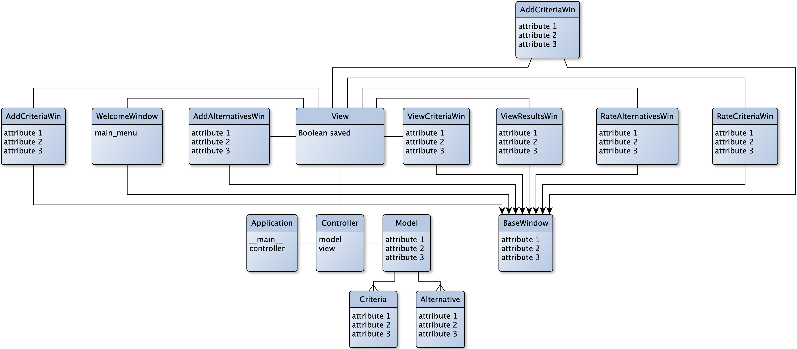
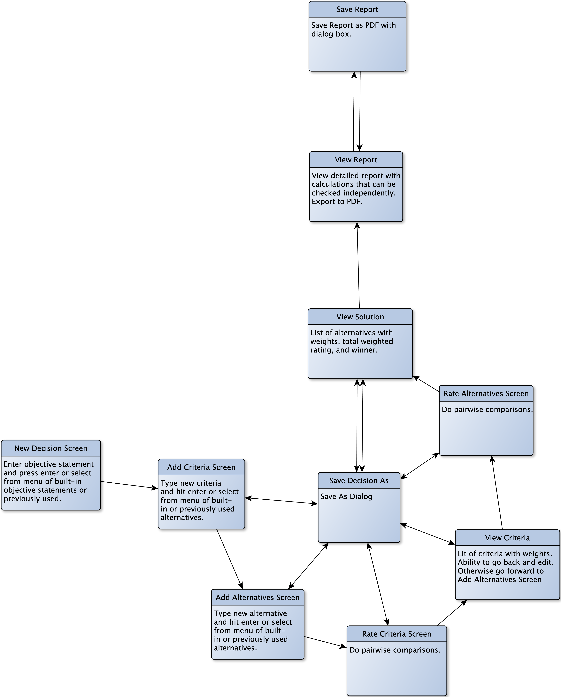

# Development Documentation

## Class Diagram



## Program Flow



## Program Start

1. The `__main__()` function initiate an `app`.

1. `app` initiates `controller`.

1. `controller` initiates `model` and adds itself as the model's `controller`.

1. `controller` initiates `view` and adds itself as the view's `controller`.

1. `view` initiates `welcome_win`.

1. `controller` calls `view_show_welcome_win`.

1. `controller` calls `view.event_loop()`.

From here out the program's behavior is dictated by the event that occurs. Events are caught by the `view` which calls a function in the `controller`. The `controller` manipulates the `model` as required. It refreshes the `view` after any change to the model, such as loading it from disk, saving it, or changing a property.

## Documentation Color Pallette

<https://flatuicolors.com/palette/us>

## Requirements

### Non-Functional

- [ ] User manual.
- [ ] SQLite for application file format.
- [ ] SQLAlchemy for ORM.
- [ ] 100 code coverage testing.

### Functional

- [ ] Save to a file.
- [ ] Save As function.
- [ ] Open a file.
- [ ] User settings.
- [ ] Infinite undo/redo.

## File Handling

We use SQLite for the [application file format](https://sqlite.org/appfileformat.html) and for user settings.

We use [SQLAlchemy](https://docs.sqlalchemy.org/en/13/orm/tutorial.html) for the Object Relational Mapper (ORM) for the application file format and possibly user settings.

Creating a new decision:

1. MainWin prompts to save unsaved changes.

1. MainWin creates a new DecisionModel instance.

## SQLAlchemy Tayloring

domain model
: DecisionModel class.

# Testing

[Coverage 5.2.1](https://coverage.readthedocs.io/en/coverage-5.2.1/) and Python 3.8.5 `unittest` are used for testing.

```zsh
# Run tests
$ make test

# Run tests and open browser to see Coverage HTML results
$ make coverage
```
